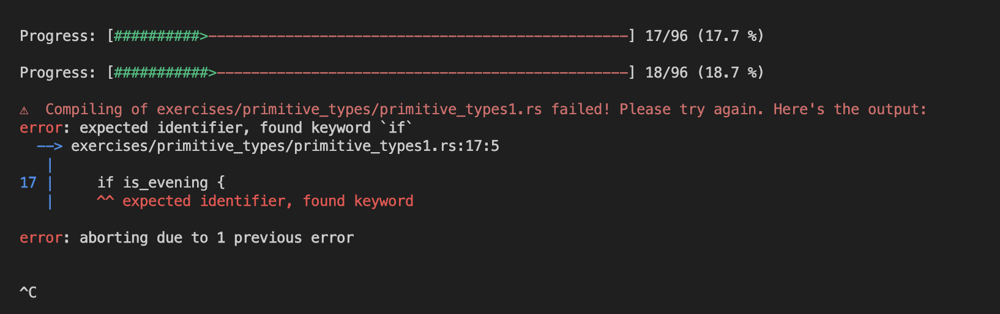
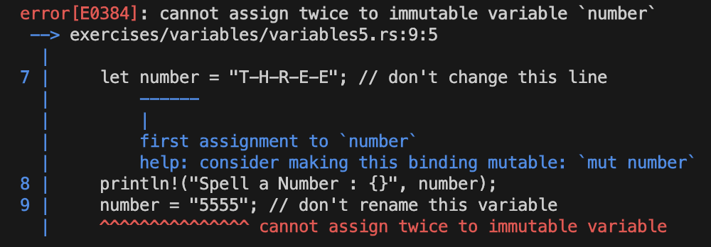

# week1 1 - 17

### 0. rust 실행하기

- [rustlings.cool](https://rustlings.cool/)

```shell
curl -L https://raw.githubusercontent.com/rust-lang/rustlings/main/install.sh | bash

git clone -b 5.6.1 --depth 1 https://github.com/rust-lang/rustlings
cd rustlings
cargo install --force --path .
```

- [zsh shell 사용시 cargo path 못찾는 이슈](https://github.com/rust-lang/rustup/issues/2436)

```shell
// .zshrc에 추가
path+=('home/__username__/.cargo/bin') 
export PATH

// 터미널 실행
source $HOME/.cargo/env
```

- 터미널에서 `rustlings watch`, `rustlings run <myExercise>` 를 통해 문제 풀기

```bash
rustlings watch
rustlings run myExercise1
```



- vscode에 rust-analyzer 플러그인 설치(문법 잡아줌.)

### 1. intro

- 문자열은 무조건 큰따옴표

```rust
// javascript: console.log('Hello and');
println!("Hello and");
```

- function안의 block에서는 `let`을 사용. 전역에서는 `let` 사용은 불가능. (`const`나 `static` 사용)
  - `const` 사용시 타입 선언해야함.

```rust
const world:&str = "world";

fn main() {
    println!("Hello {world}!");
}
```


```javascript
// javascript
let world = "world";

console.log(`Hello ${world}!`);
```

```rust
// rust
let world = "world";

println!("Hello {world}!");
```

- 아래처럼 사용도 가능.

```rust
// rust
let world = "world";

println!("Hello {}!", world);
```

### 2. variables
- 기본적으로 immutable한 속성을 가짐.

```rust
let number = "T-H-R-E-E";
println!("Spell a Number : {}", number);
number = 3; // 불가능. 타입이 같아도 불가능
println!("Number plus two is : {}", number + 2);
```



- mutable하게 재할당해서 사용하고 싶으면 `mut`을 사용해야함.
- `mut`을 사용해도 다른 타입은 재할달하여 사용불가능.

```js
// javascript
function main () {
  let x = 3; // 기본이 mutable
  console.log('Number ', x);
  x = 5;
  console.log('Number ', x); // Number 5
}
```

```rust
// rust
fn main() {
    let mut x = 3;
    println!("Number {}", x);
    x = 5;
    println!("Number {}", x); // Number 5
}
```

### 3. functions

- type `i`와 `u` 차이는 `i` 부호있는 정수(signed number)이냐 부호없는 정수(unsigned number)이냐 차이

```ts
// typescript
function main() {
  callMe(3);
}

function callMe(num: number) {
  for (let i = 0; i < num; i++) {
    console.log('Ring! Call number ', i + 1);
  }
}
```

```rust
// rust
fn main() {
    call_me(3);
}

fn call_me(num: i32) {
    for i in 0..num {
        println!("Ring! Call number {}", i + 1);
    }
}
```

```rust
fn main() {
    call_me(3);
}

fn call_me(num: i32) {
    for i in 0..num {
        println!("Ring! Call number {}", i + 1);
    }
}
```

- function에서 반환이 있는 경우에 화살표 타입지정해줘야함

```rust
fn is_even(num: i32) -> bool {
    return num % 2 == 0;
}
```

- function 인자에도 `mut` 선언하여 mutable하게 변수 재할당하여 사용가능


```rust
// price is immutable
fn sale_price(price: i32) -> i32 {
    if is_even(price) {
        return price - 10;
    } else {
        return price - 3;
    }
}
```

```rust
fn sale_price(mut price: i32) -> i32 {
    if is_even(price) {
        price = price - 10;
    } else {
        price = price - 3;
    }

    return price;
}
```

### 4. if
- `if`문 조건문에 괄호 생략가능.

```ts
// typescript
function bigger(a: number, b: number): number {
  if (a > b) {
    return a;
  }

  return b;
}
```

```rust
// rust
pub fn bigger(a: i32, b: i32) -> i32 {
    if a > b {
        return a;
    }

    return b;
}
```

- `static` 예약어를 사용하면 저장 기간의 경우 프로그램의 시작 때 부터 프로그램이 끝날 때 까지 유지.
- `static`보다 더 긴 [라이프타임](https://doc.rust-lang.org/rust-by-example/scope/lifetime.html)을 가진 것은 없다.
- `if`문을 `let`의 선언문에 직접 할당하여 사용가능.
  - 이때 `return`문 사용 x (식이 아니여서 그런건가..)

```ts
// typescript
function animalHabitat(animal: string): string {
  let identifier;

  if (animal === 'crab') {
    identifier = 1;
  } else if (animal === "gopher") {
    identifier = 2;
  } else if (animal === "snake") {
    identifier = 3;
  } else {
    identifier = 4;
  }

  let habitat;

  if (identifier === 1) {
    habitat = "Beach";
  } else if (identifier === 2) {
    habitat = "Burrow";
  } else if (identifier === 3) {
    habitat = "Desert";
  } else {
    habitat = "Unknown";
  }

  return habitat;
}
```

```rust
// rust
pub fn animal_habitat(animal: &str) -> &'static str {
    let identifier = if animal == "crab" {
        1
    } else if animal == "gopher" {
        2
    } else if animal == "snake" {
        3
    } else {
        4
    };

    // DO NOT CHANGE THIS STATEMENT BELOW
    let habitat = if identifier == 1 {
        "Beach"
    } else if identifier == 2 {
        "Burrow"
    } else if identifier == 3 {
        "Desert"
    } else {
        "Unknown"
    };

    return habitat;
}
```

### quiz 1
- 새미콜론을 붙이면 `()` 이렇게 반환. `return`문과 함께 세미콜론을 사용

```rust
fn calculate_price_of_apples(apple_count: i32) -> i32 {
    if apple_count > 40 {
        return apple_count;
    }

    apple_count * 2 // 마지막은 생략 가능
}
```

### week1 느낀점
맨날 typescript만 사용하다가 새로운 언어를 배우니 다른점들과 비교하면서 공부하니 너무 재밌다.. 러스트 너 이녀석 꽤 재밌는 친구였구나?   
아직은 쉬운단계라 후딱후딱 넘어간것 같은데 그 속에서 이건 될까 저건 될까하면서 적용해보니 러스트의 언어의 특징들을 알게되는 과정을 느꼈다.   
신기했던 포인트중 하나가 자바스크립트에서는 불가능한 선언문에 직접 if문을 할당하여 사용하는건데 이 과정을 생략이 되어 코드가 더 간단?해지는 것 같다. 처음에 이해하는데는 쉽지않았다.   

그리고 rustlings가 테스트 케이스를 보면서 문제를 풀다보니 더 재미게 풀었던 것 같다. 테스트 케이스가 보이는 코테느낌이랄까..(단위 테스트 작성 방법은 다 비슷한가보다)   
자바스크립트에서는 단위테스트 프레임워크를 추가로 다운받아서 사용해야하는데 러스트는 내장함수로 포함되어있는 것 같았다? 어쨌든 cargo라는 패키지에 dependency가 있으니 cargo에 포함되어있는 거라 똑같은 건가..?   

처음 러스트에 접해봤는데 흥미가 생겼고 러스트 신청하기 잘했단 생각이 확들어버렸다. 차주도 화이팅~~
