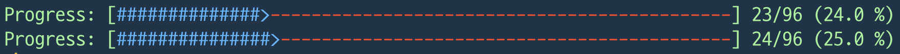

<!-- TOC start (generated with https://github.com/derlin/bitdowntoc) -->

- [Week 1 Submission](#week-1-submission)
- [TIL](#til)
  * [1. Variables And Mutability](#1-variables-and-mutability)
    + [1.1. Mutability](#11-mutability)
    + [1.2. Constants](#12-constants)
    + [1.3. Shadowing](#13-shadowing)
  * [2. Data Types](#2-data-types)
    + [2.1. Scala Type](#21-scala-type)
    + [2.2. Compound Type](#22-compound-type)
  * [3. Functions](#3-functions)
    + [3.1. Parameter](#31-parameter)
    + [3.2. Expression & Statement](#32-expression-statement)
    + [3.3. Return Values](#33-return-values)
  * [4. Comments](#4-comments)
  * [5. Control Flow](#5-control-flow)
    + [5.1. if](#51-if)
    + [5.2. Repetition](#52-repetition)
  * [6. 느낀 점](#6-)
---
<!-- TOC end -->

<!-- TOC --><a name="week-1-submission"></a>
# Week 1 Submission



<!-- TOC --><a name="til"></a>
# TIL

<!-- TOC --><a name="1-variables-and-mutability"></a>
## 1. Variables And Mutability

<!-- TOC --><a name="11-mutability"></a>
### 1.1. Mutability
- Rust에서 변수는 기본적으로 불변
  - 값이 바뀌지 않을 것으로 예상되는 변수에 대해, 컴파일러가 그 안정성을 보장해 줌
- 가변으로 만들기 위해서는 `mut` 키워드를 사용하면 됨

<!-- TOC --><a name="12-constants"></a>
### 1.2. Constants
- 상수는 `const` 키워드로 선언하며, 항상 불변
  - 즉, `mut`과 함께 사용할 수 없음
- 값의 타입이 항상 명시되어야 함
- 어떠한 스코프에서도 선언 가능
- `THREE_HOURS_IN_SECOND`와 같이, 대문자의 스케이크 케이스 형식이 관례

<!-- TOC --><a name="13-shadowing"></a>
### 1.3. Shadowing
- 새 변수를 이전 변수명과 같은 이름으로 선언하는 행위
  - `let` 키워드 반복 사용을 통해 수행

<!-- TOC --><a name="2-data-types"></a>
## 2. Data Types
- 러스트는 Statically Typed 언어
  - 컴파일 시에 모든 변수의 타입이 정해져 있어야 함.
- 러스트는 스칼라 타입과 컴파운드 타입, 두 가지 큰 범주의 변수가 존재

<!-- TOC --><a name="21-scala-type"></a>
### 2.1. Scala Type
- 하나의 값을 표현
- integer, floating-point, boolean, char
  - integer: `i8`, `i16`, `i32`, `u8`, `u16`, ...
  - floating-point: `f32`, `f64`
  - boolean: `true`, `false`
  - char: `'a'`

<!-- TOC --><a name="22-compound-type"></a>
### 2.2. Compound Type
- 여러 값을 하나의 타입으로 묶음
- **Tuple**
  - 다양한 타입의 값을 하나로 묶음
  - declare
    - `let tup: (i32, f64, u8) = (500, 6.4, 1);`
  - destructure
    - `let (x, y, z) = tup;`
    - `let second = tup.1;`
  - unit (like void)
    - `let () = ();`
- **Array**
  - 같은 타입의 여러 값을 묶음
  - declare
    - `let a = [1, 2, 3, 4, 5];`
    - `let a: [i32; 5] = [1, 2, 3, 4, 5];`
    - `let a = [3; 5];`
  - access
    - `let first = a[0];`

<!-- TOC --><a name="3-functions"></a>
## 3. Functions
- `fn` 키워드로 선언
- **스네이크 케이스**를 사용
  - e.g., `fn i_am_so_hungry() { // ...`

<!-- TOC --><a name="31-parameter"></a>
### 3.1. Parameter
- function signiture의 일부로, 함수에 전달 되는 값
- `argument` 용어와 혼용하여 사용
- 반드시 타입을 선언해야 함
  - 컴파일러가 함수가 기대하는 타입을 알고 있음으로써, 더 유용한 피드백 제공 가능

<!-- TOC --><a name="32-expression-statement"></a>
### 3.2. Expression & Statement
- 함수 본문의 두 구성 요소
  - **Expression**: 동작을 수행, 값을 반환하지 않음
  - **Statement**: 결괏값을 평가
    ```rust
    fn main() {
        let y = 6; // (O) 구문
        let x = (let y = 6); // (X) 구문을 구문에 할당 불가. 결괏값이 없기 때문
        let y = {
            let x = 3;
            x + 1
        }; // (O) 표현식 코드 블록. 세미콜론을 사용하지 않음
    }
    ```

<!-- TOC --><a name="33-return-values"></a>
### 3.3. Return Values
- `->` 뒤에 타입 명명 요망

<!-- TOC --><a name="4-comments"></a>
## 4. Comments
- `//` 사용

<!-- TOC --><a name="5-control-flow"></a>
## 5. Control Flow

<!-- TOC --><a name="51-if"></a>
### 5.1. if
- 조건에 따라 분기
- 괄호 여부 상관 X
  ```rust
  let number = 3;

  if number < 5 {
      println!("condition was true");
  } else {
      println!("condition was false");
  }
  ```
- 조건은 반드시 bool이어야 함 (python과 다른 점)
  ```rust
  let number = 3;

  if number {
      println!("number was three");
  } // (X) error[E0308]: mismatched types
  ```
- `let` 구문에서 if 사용
  - if는 표현식으로, 결과 할당 가능
    - `let number = if condition { 5 } else { 6 };`
  - 각 갈래는 같은 타입이어야 함.

<!-- TOC --><a name="52-repetition"></a>
### 5.2. Repetition
- `loop`, `while`, `for` 세 가지 종류가 존재
- **loop**
  - 명시적으로 그만두라 할 때까지 무한 반복
    ```rust
    fn main() {
        loop {
            println!("again!");
        }
    }
    ```
  - 값 반환 가능
    ```rust
    fn main() {
      let mut counter = 0;
  
      let result = loop {
        counter += 1;
  
        if counter == 10 {
          break counter * 2;
        }
      };
  
      println!("The result is {result}");
    }
    ```
  - `loop label`을 통한 모호함 제거 가능
    ```rust
    'counting_up: loop {
    // ...
          break 'counting_up;
    ```
- **while**
  - 조건이 `true`인 동안 반복
  - `while number != 0 { // ...`
- **for**
  - 컬렉션의 각 아이템을 순회
    ```rust
    fn main() {
        let a = [10, 20, 30, 40, 50];

        for element in a {
            println!("the value is: {element}");
        }
    }
    ```
  - 표준 라이브러리가 제공하는 `Range` 타입을 통해, 특정 횟수만큼 반복문 구현 가능
    ```rust
    fn main() {
        for number in (1..4).rev() {
            println!("{number}!");
        }
        println!("LIFTOFF!!!");
    }
    ```

<!-- TOC --><a name="6-"></a>
## 6. 느낀 점
- 아직까지는 공부했던 부분이어서, 복습하는 느낌으로 금방 금방 할 수 있었다.
- 러스트의 무시무시한 특장점은 소유권(Ownership) 개념으로, 다음 주차에 잘 정리해보면 좋을 것 같다.
- 확실한 언어를 선호해서 python보다 java를 좋아하는데, rust는 유연하고도 확실한 언어인 것 같아 참 괜찮다고 느꼈다.
