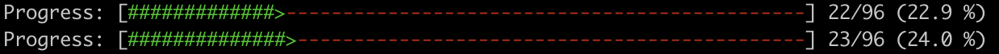

# Week 1 Submission



# TIL

## primitive_types

- Rust에서 변수는 항상 타입을 지정해줘야함. 추가로 숫자인 경우 suffix를 추가적으로 지정해줘야함.(ex. i32, u32)
- 변수는 기본적으로 immutable이기 때문에 `mut` 키워드를 사용해서 mutable하게 만들어줘야 함.

### Scalar Types

signed integer: `i8`, `i16`, `i32`, `i64` 그리고 `isize`(포인트 사이즈)
unsigned integer: `u8`, `u16`, `u32`, `u64`, `u128` 그리고 `isize`(포인터 사이즈)
floating point: `f32`, `f64`
bool, char는 기존 언어와 동일

> Rust는 Context를 통해 타입 추론이 가능하다.
> 가독성을 위한 \_(ex. 1_000 === 1000)를 사용해서 숫자를 구분할 수 있고 E-notation(ex. 1e6, 6e-4)을 사용해서 지수를 표현할 수 있다.

### Compound Types

Array: [1, 2, 3],
Tuple: (1, True)

> Tuple은 각 요소의 타입이 다를 수 있음.

## functions

함수는 `fn` 키워드를 사용해서 선언하며, 반환값은 `->`를 사용해서 지정해줄 수 있음.

```rust
fn main() {
    println!("Hello, world!");
}

fn add(x: i32, y: i32) -> i32 {
    x + y
}
```

> C/C++과 다르게 Rust는 함수의 위치가 중요하지 않음. 따라서 함수를 선언한 후에 사용해도 에러가 나지 않음.
> 추가로 Rust는 함수의 반환값을 `return` 키워드를 사용하지 않고 마지막 줄에 반환값을 지정해주면 됨.

## if

기존 언어와 동일하며 `if`, `else if`, `else` 키워드를 사용함.
`if`, `else if` 뒤에 괄호를 사용하지 않음.

```rust
fn main() {
    let number = 3;

    if number < 5 {
        println!("condition was true");
    } else {
        println!("condition was false");
    }
}
```

## quiz1

- 기본적인 가변 변수와 반복문을 사용해서 해결가능한 문제였음.

## ETC

- 아직까지는 간단해서 금방 끝날거라 생각했는데 오랫만에 React code가 아닌 언어로 코딩을 하려고 하니 어색함이 느껴졌음
- 중간중간 quiz를 풀면서 Rust의 문법을 익히는 것이 좋을 것 같다.
