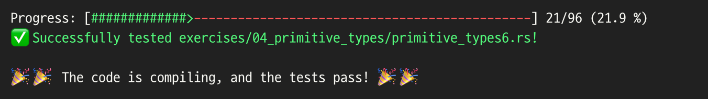
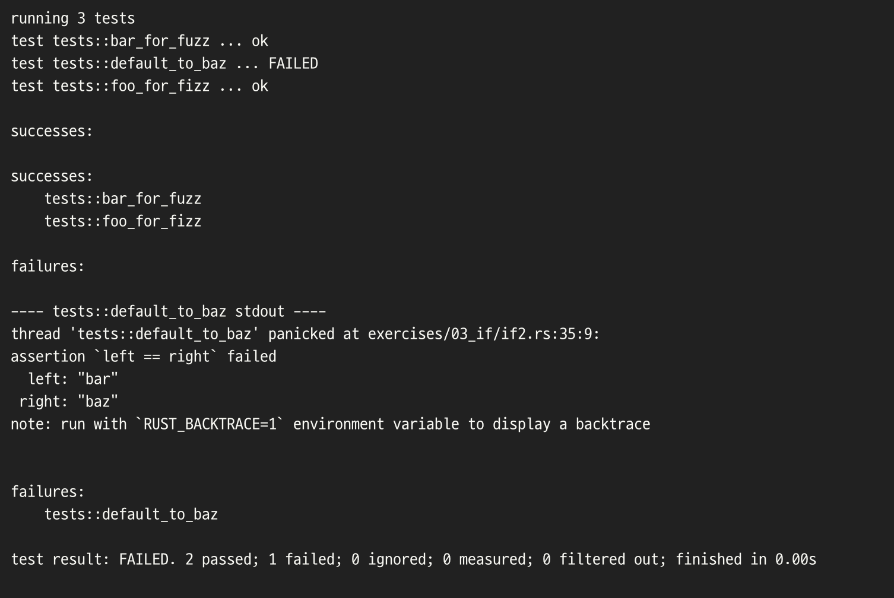
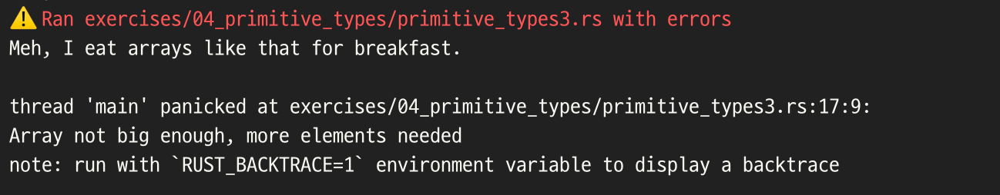

## Week 1 Result


## What I felt

* Rust는 내가 기존에 알던 언어의 개념과는 너무 다르며 컨셉이 확실하다고 느껴진다.
  * 확실한 컨셉이 뭔지 설명할 수 있는 그날까지.. (아직 단순 느낌만)
* 이런 확고한 다른 컨셉에서 받는 신박한 느낌 때문에 재밌다.

## What I interested
* 컴파일 과정에서 에러 뱉는 것이 친절하다.
  
* 짧게나마 보았지만 test 코드 결과 값이 신기하게 나왔다.
* panic 이 부분도 신기하게 느껴짐
  

## What I learned

불변성 / 가변성
* let - 변수 불변 선언
* let mut - 변수 가변 선언

Shadowing
```rust
let x = 3;

let x = x + 5;
```

변수의 타입 선언
```rust
let x :i32 = 4;

let y :&str = "Hello?";
```

함수
```rust
fn test (x :i32) -> i32 {
  x + x
}
```

반복문
```rust
for i in (0..100) {
  println!("print {}", i)  
}
```

빈 리스트 만들어서 값 넣기 (그냥 찾아봄)
```rust
let mut a = Vec::new();

for i in 0..100 {
  a.push(i);
}
```
리스트에 사이즈 구성 (리스트에 타입 선언)
```rust
let a :[&str;100] = ["wow";100];
```
리스트 슬라이스 (참조)
```rust
let a :[i32;5] = [1,2,3,4,5];

let slice :&[i32] = &a[2..4]; // index

println("{:?}", slice);
```
튜플
```rust
let a :(i32, &str, f64) = (77, "lucky", 7.7);

let (b, c, d) = a;

let f = a.2;

println!("{} is {}", b, c); // 77 is lucky
println!("{} is {}", f, c); // 7.7 is lucky
```