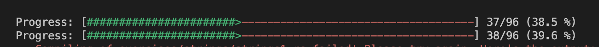

# week2



### 1. vecs

- `vec`은 가변 크기의 배열을 나타내는데 사용된다.
- 동적으로 크기가 조정되는 배열

```rust
let mut vec = Vec::new();

vec.push(1);
vec.push(2);

let v = vec![10, 20, 30, 40]; 
```

- javascript와 비슷한 배열 메소드를 제공하는 것 같다.

```rust
let v: Vec<i32> = (1..).filter(|x| x % 2 == 0).take(5).collect(); // (2, 4, 6, 8, 10)
```

```javascript
// js
let v = [1, 2, 3, 4, 5, 6, 7, 8, 9, 10].filter((x) => x % 2 === 0);
```

- `iter_mut()` 메서드는 컬렉션의 가변(mutable) 참조를 통해 요소를 반복할 수 있다.
- 가변 참조이므로 `*num`을 통해 해당 요소를 수정할 수 있음.

```rust
for num in numbers.iter_mut() {
  *num *= 2;
}
```

- `map` 메서드는 값을 반환한다. javascript의 map과 같다.

```rust
v.iter().map(|element| {
    element * 2
}).collect()
```

### 2. move_semantics
- 변수는 자신의 리소스?(컨텍스트의 느낌 같음)를 해제하는 역할을 담당하므로 **리소스에는 소유자가 하나만 있을 수 있다.**
- 할당(`let x = y`)을 수행하거나 값으로 함수 인수를 전달할 때(`foo(x)`) 리소스의 소유권이 이전된다.
- 리소스가 이동되면 이전의 소유자는 다시 사용할 수 없다. 이렇게 하면 매달린 포인터가 생성되는 것을 방지할 수 있다.
  - 약간 이런 러스트의 보수적인 방법으로 메모리를 잘 관리할 수 있는 것 같은 느낌
- 재밌는 개념 같은.. javascript의 mutable한 변수 재할당의 느낌?
  - javascript에서는 이러한 mutable한 코드는 사이드이펙을 발생시키기에 좋지 않은 코드인데 rust에서는 어떨까?

```rust
#[test]
fn main() {
    let vec0 = vec![22, 44, 66];

    // fill_vec로 vec0의 소유권이 넘어감.
    let mut vec1 = fill_vec(vec0);
    // 넘겨받은 vec1이 다시 소유권을 가짐.

    assert_eq!(vec1, vec![22, 44, 66, 88]);
}

fn fill_vec(mut vec: Vec<i32>) -> Vec<i32> {
  // 이전된 소유권
  vec.push(88);

  // 다시 반환하여
  vec
}
```

```rust
#[test]
fn main() {
  let mut x = 100;
  // 가변 참조의 소유권을 y에게 넘겨줌
  let y = &mut x;
  // 가변 참조 y 수정
  *y += 100;

  // x는 200이고, x의 가변 참조의 소유권을 z로 이전
  let z = &mut x;
  // x의 가변 참조 z 수정
  *z += 1000;
  assert_eq!(x, 1200);
}
```

-  아래 케이스가 안되는 이유는 리소스에는 소유자가 하나만 있을 수 있기에 아래 경우는 y, z가 x에 대한 소유권을 가지고 있기에 불가능.

```rust
#[test]
fn main() {
    let mut x = 100;
    let y = &mut x;
    let z = &mut x;

    *y += 100;
    *z += 1000;
    assert_eq!(x, 1200);
}
```

### 3. structs
- 요 친구는 타입스크립트의 타입과 인터페이스 같은 느낌.

```rust
struct ColorClassicStruct {
  red: i32,
  green: i32,
  blue: i32,
}

let green = ColorClassicStruct {
  red: 0,
  green: 255,
  blue: 0,
};
```

```ts
// typescript
type ColorClassicType = {
  red: number;
  green: number;
  blue: number;
}

let green: ColorClassicType = {
  red: 0,
  green: 255,
  blue: 0,
};
```

- javascript의 spread operator처럼 사용도 가능

```rust
let order_template = create_order_template();

let your_order = Order {
    name: "Hacker in Rust".to_string(),
    count: 1,
    ..order_template
};
```

### 4. enums
- `enum`은 여러 가지 관련 있는 값들을 하나의 타입으로 그룹화하는 데 사용

```rust
enum Message {
    Move { x: i32, y: i32 },
    Echo(String),
    ChangeColor(i32, i32, i32),
    Quit
}

// impl과 함께 구조체로 사용 가능.
impl Message {
    fn call(&self) {
        println!("{:?}", self);
    }
}

fn main() {
    let messages = [
        Message::Move { x: 10, y: 30 },
        Message::Echo(String::from("hello world")),
        Message::ChangeColor(200, 255, 255),
        Message::Quit,
    ];

    for message in &messages {
        message.call();
    }
}
```

- `match`를 사용하여 제어 흐름 구조처럼 사용할 수 있는데 switch문이나 조건문처럼 사용할 수 있는 느낌이다. 패턴 매칭을 통해 다양한 값들에 대한 패턴을 매칭하고 해당하는 코드 블록을 실행한다.

```rust
enum Message {
    ChangeColor(u8, u8, u8),
    Echo(String),
    Move(Point),
    Quit
}

struct State {
    color: (u8, u8, u8),
    position: Point,
    quit: bool,
    message: String,
}

impl State {
    fn change_color(&mut self, color: (u8, u8, u8)) {
        self.color = color;
    }

    fn quit(&mut self) {
        self.quit = true;
    }

    fn echo(&mut self, s: String) {
        self.message = s
    }

    fn move_position(&mut self, p: Point) {
        self.position = p;
    }

    fn process(&mut self, message: Message) {
        // switch 문이나, object의 형태로 조건에 맞게 호출되도록 사용가능.
        // enum과 함께 사용되어진다.
        match message {
            Message::ChangeColor(a, b, c) => self.change_color((a, b, c)),
            Message::Echo(a) => self.echo(a),
            Message::Move(point) => self.move_position(point),
            Message::Quit => self.quit(),
        }
    }
}

let mut state = State {
    quit: false,
    position: Point { x: 0, y: 0 },
    color: (0, 0, 0),
    message: "hello world".to_string(),
};

// state.process를 실행.
state.process(Message::ChangeColor(255, 0, 255));
state.process(Message::Echo(String::from("Hello world!")));
state.process(Message::Move(Point { x: 10, y: 15 }));
state.process(Message::Quit);
```

### week2 느낀점
어쨌든 fe개발자다보니 가장 많이 사용했던게 javascript였고 javascript, typescript와 비교하면서 공부를 하고 있는데, 2주차임에도 어렵고 헷갈리는 포인트들이 많았다. 특히 소유권을 넘기고 가져오는 부분은 개념적으로 헷갈리는 것 같다. 그래도 정리를 해보면서 조금은 정리가 되어서 다행이다.   
요 부분들을 이해하고 넘어가지 않으면 나중에 멀티쓰레드.. 포인터 처리나 메모리 할당 해제등 어려운 개념들을 더 이해하기 어려울 것 같다는 생각이 들었따..   
그래서 공식문서로는 이해하기가 어려운 것 같아서 책구매완. 새로운 언어는 오랜만에 접하다보니 어려운 부분들이 있지만, 러스트의 언어적인 특성들이 하나둘씩 보이기 시작해서 생각보다 재미있는 것 같다.   
러스트로 코드를 짜볼 수 있는 그날까지 화이팅!
