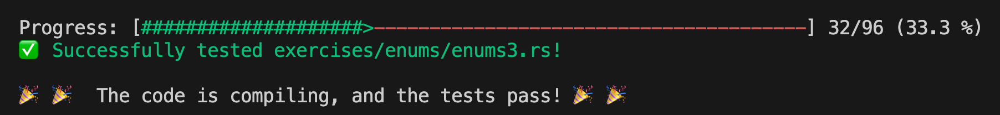

# week2



### primitive_types

- `panic` : println과 달리 터미널 창에 빨간 글자로 error 메세지를 보여준다.
- `&` : & 연산자는 참조를 생성한다. 해당 값에 대한 참조를 만들고, 그 값을 대신하여 해당 참조를 사용할 수 있게 해준다. rust 슬라이스는 컴파일 시간에 크기를 알 수 없고 런타임에 크기가 결정된다.

### vector

- vector 선언 방법

```rust
  let v: Vec<i32> = Vec::new();
  // or
  let v = vec![1, 2, 3];
```

- https://doc.rust-lang.org/stable/book/ch08-01-vectors.html

### move_semantics

### structs

### enums
