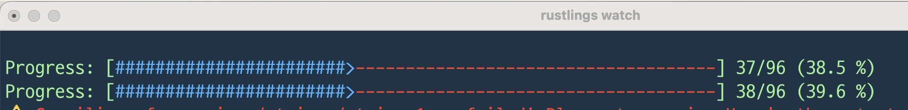

<!-- TOC start (generated with https://github.com/derlin/bitdowntoc) -->

- [Week 2 Submission](#week-2-submission)
- [TIL](#til)
    * [1. Vector](#1-vector)
    * [2. Ownership](#2-ownership)
        + [2.1. What is Ownership?](#21-what-is-ownership)
        + [2.2. Variable Scope](#22-variable-scope)
        + [2.3. Move](#23-move)
        + [2.4. Clone](#24-clone)
        + [2.5. Copy](#25-copy)
        + [2.6. Function](#26-function)
        + [2.7. Reference And Borrow](#27-reference-and-borrow)
        + [2.8. Mutable Reference](#28-mutable-reference)
        + [2.9. Dangling Reference](#29-dangling-reference)
        + [2.10. Reference Rules](#210-reference-rules)
    * [2.11. Slice](#211-slice)
    * [3. Struct](#3-struct)
        + [3.1. Basic of Struct](#31-basic-of-struct)
        + [3.2. Method Syntax](#32-method-syntax)
        + [3.3. Associated Function](#33-associated-function)
    * [4. Enums](#4-enums)
        + [4.1. Defining an Enum](#41-defining-an-enum)
        + [4.2. The `Option` Enum](#42-the-option-enum)
        + [4.3. match](#43-match)
        + [4.4. if let](#44-if-let)
    * [5. 느낀 점](#5-)

<!-- TOC end -->

<!-- TOC --><a name="week-2-submission"></a>
# Week 2 Submission



<!-- TOC --><a name="til"></a>
# TIL

<!-- TOC --><a name="1-vector"></a>
## 1. Vector
- 러스트는 `collection`이라는 표준 라이브러리를 제공하며, 이를 통해 유용한 데이터 구조를 편리하게 사용할 수 있다.
- Vector는 컬렉션의 일종으로, 같은 타입의 값을 하나 이상 저장할 수 있다.
- 선언 시..
    - 빈 벡터를 선언하기 위해서는 다음과 같이 타입 명시가 필요하다.
        - `let v: Vec<i32> = Vec::new();`
    - 초깃값이 존재하는 경우, 타입 추론 덕분에 타입 명시가 필요하지 않다.
        - `let v = vec![1, 2, 3];`
- `push` 메서드를 통해 새로운 아이템을 추가할 수 있다.
    - 주의할 점은, 변수의 값을 변경하는 행위이기에 선언 시 `mut` 키워드가 붙어야 한다.
  ```rust
  let mut v = Vec::new();
  
  v.push(2);
  v.push(4);
  v.push(6);
    ```
- 인덱싱과 `get` 메서드, 두 가지 방식을 통해 아이템을 읽을 수 있다.
    - `let third: &i32 = &v[2];` 와 같이 인덱싱이 가능하다.
    - `get` 메서드는 `Option<&T>` 밸류를 반환하며, 이는 Index Out Of Bounds Exception을 유연하게 처리할 수 있게 해준다.
      ```rust
      let third: Option<&i32> = v.get(2);
      match third {
          Some(third) => println!("The third element is {third}"),
          None => println!("There is no third element."),
      }
      ```
- 반복은 아래와 같이 수행할 수 있으며, 가변 참조자를 통한 각 요소 수정 작업 또한 수행 가능하다.
    ```rust
    let v = vec![100, 32, 57];
    for i in &v {
        println!("{i}");
    }

    let mut v = vec![100, 32, 57];
    for i in &mut v {
        *i += 50;
    }
  ```
    - `for`문 안에서 아이템 추가/제거 작업을 시도한다면, 컴파일 에러가 발생한다.
        - 아래에서 배울 `borrow checker's rule`에 의해 안전성이 보장된다.
        - 러스트는 이런 점이 참 좋다.

<!-- TOC --><a name="2-ownership"></a>
## 2. Ownership

<!-- TOC --><a name="21-what-is-ownership"></a>
### 2.1. What is Ownership?
- 소유권(Ownership)은 러스트에서 메모리를 관리하기 위한 규칙의 모음이다.
- 지금까지의 대표적인 프로그래밍 언어는 GC, 명시적인 할당/해제를 통해 메모리 관리를 진행해왔다.
    - 러스트는 제 3의 방식인 **소유권** 개념을 도입했다.
    - 러스트라는 언어를 이해하기 위해 필수적인 개념이며, 러스트의 알파이자 오메가이다.
- 소유권은 아래와 같은 규칙을 가진다.
    - 각 값은 **소유자(Owner)**가 존재한다.
    - 한 값은 한 소유자만 소유할 수 있다.
    - 소유자가 **scope** 밖으로 벗어나면, 값이 버려진다.(**dropped**)

<!-- TOC --><a name="22-variable-scope"></a>
### 2.2. Variable Scope
- 변수는 **스코프**(scope)라는 개념을 가진다.
  ```rust
  {                      // s는 아직 선언되지 않아서 여기서는 유효하지 않습니다
      let s = String::from("hello");   // 이 지점부터 s가 유효합니다

      // s로 어떤 작업을 합니다
  }                      // 이 스코프가 종료되었고, s가 더 이상 유효하지 않습니다
  ```
- 아래와 같은 두 가지 특징을 기억해야 한다.
    1. 위 `s`는 **스코프 내에 나타난 순간**부터 유효하다.
    2. 유효기간은 **스코프 밖으로 벗어나기 전** 까지다.
- 위 예시에서 나온 String 타입은 `heap`에 저장되는 데이터이다.
    - 다른 언어와 동일하게, 러스트는 크게 변수를 `stack`과 `heap`에 저장한다.
        - 컴파일 타임에 크기를 알 수 있는 데이터는 스택, 알 수 없는 데이터는 힙에 저장된다.
- 힙에 저장되는 데이터는 사용될 **메모리 공간이 할당**되어야 하며, 실행 중 할당자에게 메모리를 요청한다.
    - 또한, 사용을 마쳤을 때 **메모리를 해제**(반납)할 방법이 필요하다.
- 러스트는 변수가 **스코프를 벗어나는 순간**, 자동으로 `drop` 함수를 호출해 메모리를 해제한다.

<!-- TOC --><a name="23-move"></a>
### 2.3. Move
- 러스트는 절대 자동으로 데이터에 대한 **깊은 복사**를 수행하지 않는다.
- 얕은 복사만이 수행되는데, 이를 러스트에선 **이동**(Move)이라고 칭한다.
    - 이동이라 표현하는 이유는, 해당 메모리 영역에 대한 소유권이 이동하는 개념이기 때문이다.
    - 즉, 이동 후 기존 소유권을 가지고 있던 변수는 더 이상 유효하지 않다.
```rust
let s1 = String::from("hello");
let s2 = s1;

println!("{}, world!", s1);
```
- 위와 같은 경우에, `s1`이 가리키고 있던 주소를 `s2`가 가리키게 된다.
    - 이 상태에서 같은 스코프 내에서 두 변수가 모두 유효하다면?
        - 두 변수가 동일한 메모리를 해제하려 시도할 것이며, **중복 해제**(double free) 에러가 발생한다.
    - 이를 방지하기 위해, 러스트는 이동 시 기존 변수를 더 이상 유효하지 않도록 한다.
- 즉, 위와 같이 이동된 변수를 사용하려 시도하면 `borrow of moved value` 에러가 발생한다.

<!-- TOC --><a name="24-clone"></a>
### 2.4. Clone
- 러스트는 힙 데이터에 대한 깊은 복사를 위해, 공용 메서드인 `clone`을 제공한다.
```rust
let s1 = String::from("hello");
let s2 = s1.clone();

println!("s1 = {}, s2 = {}", s1, s2);
```

<!-- TOC --><a name="25-copy"></a>
### 2.5. Copy
- 스택에 저장되는 데이터는 **이동**이라는 개념이 적용되지 않는다.
```rust
let x = 5;
let y = x;

println!("x = {}, y = {}", x, y);
```
- 정수형과 같이 컴파일 타임에 크기가 고정되는 데이터는, 모두 스택에 저장된다.
    - 스택 데이터는 빠른 복사가 가능하며, 자동으로 깊은 복사를 수행해도 무해하다.
- 스택에 저장되는 데이터는 `Copy` 트레이트를 구현하게 된다.
    - 이 트레이트가 있으면, 이동하지 않고 깊은 복사가 이루어진다.
- `Drop` 트레이트가 구현된 경우, `Copy` 트레이트가 구현될 수 없다.

<!-- TOC --><a name="26-function"></a>
### 2.6. Function
- 함수에 값이 전달되는 행위 또한 소유권이 이동된 것으로 간주된다.
    - 즉, 매개변수로 사용된 변수를 다시 사용하려 하면 에러가 발생한다.

<!-- TOC --><a name="27-reference-and-borrow"></a>
### 2.7. Reference And Borrow
- 위와 같은 번거로움을 방지하기 위해, **참조자**(reference)란 개념이 존재한다.
- 참조자는 해당 변수에 저장된 데이터의 주소에 접근할 수 있도록 해주는, **포인터 개념**이다.
    - 매개변수 전달 시, `&s1`과 같이 `&` 구문을 통해 참조자로써 값 전달이 가능하다.
    - 받는 쪽에선 `&String`과 같이 타입을 정의함으로써 참조하는 값이라는 점을 명시한다.
- 위 개념을 통해, 함수 호출 이후에도 변수를 사용할 수 있게 된다.
    - 이러한 행위를 러스트에서는 **대여**(Borrow)라는 용어로 표현한다.

<!-- TOC --><a name="28-mutable-reference"></a>
### 2.8. Mutable Reference
- 가변 참조자의 개념 또한 존재한다.
    ```rust
    fn main() {
        let mut s = String::from("hello");
    
        change(&mut s);
    }
    
    fn change(some_string: &mut String) {
        some_string.push_str(", world");
    }
    ```
- 함수 내에서 빌린 값을 직접 수정할 수 있게 된다.
- 가변 참조자엔 큰 제약사항 한가지가 존재한다.
    - 어떤 값에 대한 가변 참조자가 있다면, 해당 값에 대한 참조자는 더 이상 생성할 수 없다.
- 이러한 제약은 **data race**를 방지해준다.
- 불변 참조자와 가변 참조자를 동시에 사용하는 것 또한 허용되지 않는다.
    - 불변 참조자를 사용 중인 곳에서는, 가변 참조자에 의해 값이 수정될 것을 인지하지 못하기 때문이다.
- 다만, 참조자는 해당 참조자가 마지막으로 사용된 부분까지만 유효하다.
    - 즉, 마지막 사용 후 가변 참조자 재 선언은 문제없다.

<!-- TOC --><a name="29-dangling-reference"></a>
### 2.9. Dangling Reference
- 러스트는 **댕글링 포인터**(dangling pointer)가 발생하지 않음을 보장해준다.
    - 댕글링 포인터란, 포인터가 보고 있는 메모리의 일부가 해제됨으로써, 이상한 메모리를 보게 된 포인터를 의미한다.
- 러스트는, 어떤 데이터에 대한 참조자가 스코프를 벗어나기 전에, 해당 데이터가 먼저 스코프를 벗어나는지 여부를 검사한다.
  ```rust
  fn dangle() -> &String {
    let s = String::from("hello");

    &s
  }
  ```
    - 위와 같은 예시를 통해 확인할 수 있는데, `missing lifetime specifier` 에러가 발생한다.
        - lifetime 관련 개념은 나중에 배운다고 한다.
    - 빌린 값에 대한 참조자(포인터)를 반환하게 되는데, 빌린 값은 스코프를 벗어나므로 더 이상 존재하지 않는다.

<!-- TOC --><a name="210-reference-rules"></a>
### 2.10. Reference Rules
- 아래와 같은 규칙만 잘 생각하면, 참조자를 잘 활용할 수 있다.
    1. 단 하나의 가변 참조자만 갖거나, 여러개의 불변 참조자를 가질 수 있다.
    2. 참조자는 항상 유효해야 한다.

<!-- TOC --><a name="211-slice"></a>
## 2.11. Slice
```rust
let s = String::from("hello world");

let hello = &s[0..5];
let world = &s[6..11];
```
- 이렇게 문자열의 일부를 잘라낼 수 있는데, 이를 `slice`라고 칭한다.
    - String의 일부분을 가르키는 **참조자** 개념으로, 시작 위치와 길이을 데이터 구조에 저장한다.
    - 문자열 슬라이스는 `&str` 타입으로 표현한다.
- 위에서 살펴본건 문자열 슬라이스로 문자열에 한정되어 있고, 더 범용적인 슬라이스 또한 존재한다.
  ```rust
  let a = [1, 2, 3, 4, 5];
  let slice = &a[1..3];
  ```
    - 위와 같이, 모든 컬렉션에 슬라이스 개념을 사용할 수 있다.

<!-- TOC --><a name="3-struct"></a>
## 3. Struct

<!-- TOC --><a name="31-basic-of-struct"></a>
### 3.1. Basic of Struct
```rust
struct User {
    active: bool,
    username: String,
    email: String,
    sign_in_count: u64,
}
```
- 구조체(struct)는 여러 값을 묶고, 이름을 지어서 의미 있는 묶음을 정의한다.
    - method를 가질 수 있는 C의 struct, 즉 class 개념으로 생각하면 편하다.
- 아래와 같은 형태로 선언할 수 있으며, `.`(dot)을 통해 필드에 접근할 수 있다.
  ```rust
  let mut user1 = User {
    active: true,
    username: String::from("someusername123"),
    email: String::from("someone@example.com"),
    sign_in_count: 1,
  };
  
  user1.email = String::from("anotheremail@example.com");
  ```
    - 수정 또한 가능한데, 역시 `mut` 키워드를 통해 가변 인스턴스로 선언되어야 한다.
        - 일부 필드만 가변으로 선언하는 것은 불가능하고, 인스턴스 전체가 가변성을 지닌다.
- **필드 초기화 축약법** (field init shorthand) 개념이 존재한다.
    - 변수명과 필드명이 같을 때 사용 가능하며, 아래와 같이 쓸 수 있다.
      ```rust
      User {
          active: true,
          username,
          email,
          sign_in_count: 1,
      }
      ```
- **구조체 업데이트 문법**(struct update syntax)이 존재한다.
    - 바꿀 값만 바꾸고, 나머지 값은 기존 값을 그대로 가져와 새 인스턴스를 만들 수 있다.
      ```rust
      let user2 = User {
          email: String::from("another@example.com"),
          ..user1
      };
      ```
        - 주의할 점은, 이 경우 `user1`의 특정 필드 소유권이 `user2`로 넘어갔으므로, `user1`은 더 이상 유효하지 않다.
            - `Copy` 트레이트가 구현된 필드만 이동된다면, `user1`은 여전히 유효하다.
- **튜플 구조체**(tuple struct) 개념 또한 존재한다.
    - `struct Color(i32, i32, i32);`와 같이 필드 타입의 나열을 통해 선언할 수 있다.
- **유닛 구조체**(unit-like struct)도 있다.
  ```rust
  struct AlwaysEqual;
  //...
  let subject = AlwaysEqual;
  ```
    - 데이터가 필요 없지만, 의미가 필요한 경우에 유용하게 쓸 수 있을 듯 하다.

<!-- TOC --><a name="32-method-syntax"></a>
### 3.2. Method Syntax
- **메서드**(method)는 우리 모두에게 익숙한 개념이다.
    - 간단히 말하면 클래스의 함수이다.
- 러스트에서도 이와 동일한 개념으로 사용되는데, 선언 방식이 살짝 다르다.
  ```rust
  struct Rectangle {
    width: u32,
    height: u32,
  }

  impl Rectangle {
    fn area(&self) -> u32 {
      self.width * self.height
    }
  }
  ```
    - `impl` 키워드로 선언된 블락 안에 메서드를 선언할 수 있다.
    - `&self`는 `self: &Self`를 줄인 것으로, 항상 메서드의 첫 번째 매개변수로 사용되어야 한다.
        - 메서드가 인스턴스의 소유권을 가져오는 행위는 적합하지 않으므로, 참조자를 사용한다.
        - `mut` 키워드를 붙이면 수정이 가능하다.
- 한 구조체의 `impl` 블록을 여러개 선언할 수도 있는데, 알아만 두자.

<!-- TOC --><a name="33-associated-function"></a>
### 3.3. Associated Function
- **연관 함수**(associated function)란, `impl` 블록 안에 구현된 모든 함수를 의미한다.
- 연관 함수는 `self`를 첫 매개변수로 가지지 않아도 된다.
    - 메서드가 아닌 연관 함수가 되는 것인데, 이는 java 혹은 python의 `static method`의 개념과 일치한다.
- 연관 함수는 `let sq = Rectangle::square(3);`와 같이, `::` 구문을 통해 호출한다.
    - 연관 함수는 구조체의 네임스페이스 안에 있기 때문이다.
        - 네임 스페이스 관련 설명: [링크 참조](https://doc.rust-lang.org/reference/names/namespaces.html)

<!-- TOC --><a name="4-enums"></a>
## 4. Enums

<!-- TOC --><a name="41-defining-an-enum"></a>
### 4.1. Defining an Enum
- **열거형**(enums)은 가질 수 있는 값(rust에선 **variant**로 표현)을 열거함으로써, 특정한 타입을 정의할 수 있게 한다.
    - 열거형이 어떤 의미를 가지는지, 어떤 장점이 있는지는 다른 언어와 동일하므로 넘어가겠다.
- 아래와 같이 선언 및 접근이 가능하다.
  ```rust
  enum IpAddrKind {
    V4,
    V6,
  }
  
  // ...
  
  let four = IpAddrKind::V4;
  let six = IpAddrKind::V6;
  
  // ...
  
  route(IpAddrKind::V4);
  route(IpAddrKind::V6);
  ```
- 각 variant에 데이터를 넣는 것 또한 아래 형태로 가능하다.
  ```rust
  enum Message {
    Quit,
    Move { x: i32, y: i32 },
    Write(String),
    ChangeColor(i32, i32, i32),
  }
  ```
    - 이름이 있는 필드를 가질 수도 있고, 여러 값을 가질 수도 있다.
        - 여러 언어중 가장 유연한 enum이 아닌가 싶다.
- `메서드` 또한 정의가 가능하다.
  ```rust
  impl Message {
      fn call(&self) {
          // ...
      }
  }

  let m = Message::Write(String::from("hello"));
  m.call();
  ```
- 이런 점들을 보아 `struct`와 거의 동일하다고 할 수 있다.
    - 차이는 키워드와 묶을 수 있는 타입이 존재한다는 점 정도이다.

<!-- TOC --><a name="42-the-option-enum"></a>
### 4.2. The `Option` Enum
- `Option<T>` 타입은 러스트의 표준 라이브러리로 정의된 열거형이다.
    - `None, Some(T)` variant들을 통해, 값의 존재 유무를 표현한다.
- 즉, 러스트에는 `null` 개념이 존재하지 않으며 `Option`으로 존재 유무를 판단한다.
    - 아주 좋다. null 퇴출 운동

<!-- TOC --><a name="43-match"></a>
### 4.3. match
- 러스트는 `match`라는 제어 흐름 연산자를 가지고 있다.
    - `switch`와 유사한 개념으로 생각하면 된다.
    - 리터럴, 변수명, 와일드카드 등 다양한 패턴 구성이 가능하다.
- 열거형은 `match`로 활용 가능한 타입의 아주 좋은 예시이다.
  ```rust
  enum Coin {
      Penny,
      Nickel,
      Dime,
      Quarter,
  }

  fn value_in_cents(coin: Coin) -> u8 {
      match coin {
          Coin::Penny => {
              println!("Lucky penny!");
              1
          }
          Coin::Nickel => 5,
          Coin::Dime => 10,
          Coin::Quarter => 25,
      }
  }
  ```
    - 위와 같이 `=>` 구문을 통해 실행 코드를 작성 가능하다.
        - 각 갈래는 표현식이며, 결과는 표현식에 대해 반환되는 값이다.
        - 중괄호를 통해 여러 줄의 코드도 실행 가능하며, 이 경우 맨 끝에 붙는 쉼표가 옵션이 된다.
- 배리언트의 값을 변수로써 **바인딩**하는 것 또한 가능하다.
  ```rust
  fn value_in_cents(coin: Coin) -> u8 {
      match coin {
          Coin::Penny => 1,
          Coin::Nickel => 5,
          Coin::Dime => 10,
          Coin::Quarter(state) => {
              println!("State quarter from {:?}!", state);
              25
          }
      }
  }
  ```
    - `Quarter`라는 배리언트의 String 데이터를 `state`란 이름의 변수로 바인딩한 모습이다.
- **`match`는 차갑다.**
    - `match`는 갈래의 가능한 모든 패턴에 대한 경우를 다뤄야 한다.
      ```rust
      let dice_roll = 9;
      match dice_roll {
            3 => add_fancy_hat(),
            7 => remove_fancy_hat(),
            other => move_player(other),
      }
      ```
    - 마지막에 선언된 갈래에 선언된 특정 변수는, 나열되지 않은 모든 값에 대한 패턴을 커버한다.
        - 이를 **포괄 패턴**이라고 한다.
    - 값이 필요 없을 경우, `_ => reroll(),`와 같이 값을 무시할 수 있다.
    - `_ => (),`와 같이 유닛 값을 활용해 아무 일도 하지 않을 수도 있다.

<!-- TOC --><a name="44-if-let"></a>
### 4.4. if let
```rust
let config_max = Some(3u8);
if let Some(max) = config_max {
    println!("The maximum is configured to be {}", max);
}
```
- `if let` 키워드를 통해, 한 갈래에 대한 처리와 나머지 갈래에 대한 처리를 단순화할 수 있다.
    - `Option` 처리에 유용하다.
- `else` 또한 당연히 사용 가능하다.
  ```rust
  let mut count = 0;
  if let Coin::Quarter(state) = coin {
      println!("State quarter from {:?}!", state);
  } else {
      count += 1;
  }
  ```

<!-- TOC --><a name="5-"></a>
## 5. 느낀 점
- 어렵다, 러스트!
- 그래도 운영 단게에서 흔히 겪는 메모리 관련 이슈, null 관련 이슈 등을 컴파일 단에서 모두 방지 가능한 것이 정말 맘에 든다.
    - java의 `NullPointException`은 참 최악이다
