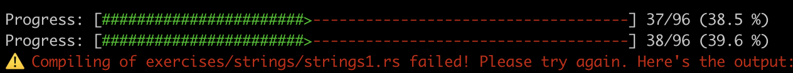

# Week 2 Submission



# TIL

## vecs

- vec는 벡터를 의미하며, 동적으로 크기가 변경될 수 있는 배열을 의미함.(기존 언어들과 동일)
- 비어있는 새 벡터를 생성할 수도, 값이 이미 들어가 있는 벡터를 생성할 수도 있음.

```rust
let v: Vec<i32> = Vec::new();
let v = vec![1, 2, 3];
```

- 벡터 값에 대해 반복문을 사용할 수 있음.

```rust
let v = vec![100, 32, 57];
for i in &v {
    println!("{}", i);
}
```

## move_semantics

- 벡터 값에 대해 변경을 할 수 있음.

```rust
let mut v = vec![100, 32, 57];
for i in &mut v {
    *i += 50;
}
```

- clone을 사용해서 벡터의 값을 복사할 수 있음.

```rust
let v = vec![1, 2, 3, 4, 5];
let v2 = v.clone();
```

- 함수의 인자로 벡터를 넘길 때, 해당 벡터의 소유권을 넘기는 것이 아니라 참조를 넘기는 것이기 때문에 함수 내에서 벡터를 변경하면 컴파일 에러가 발생함.
  - `&`를 사용해서 참조를 넘기는 것이 아니라 `&mut`를 사용해서 mutable 참조를 넘겨야 함.

```rust
fn main() {
    let mut data = "Rust is great!".to_string(); // mutable string
    get_char(data.clone()); // clone data
    string_uppercase(&mut data);
}

fn get_char(data: String) -> char {
    data.chars().last().unwrap()
}

fn string_uppercase(mut data: &mut String) { // mutable reference
    *data = data.to_uppercase();

    println!("{}", data);
}
```

## structs / enums

- struct와 enum은 기존 언어와 동일하게 사용할 수 있어서 크게 어렵지 않았음.
- 구조체 업데이트 문법에서 `..`을 사용해서 나머지 필드를 기존 구조체에서 가져올 수 있음.
- 필드가 없는 구조체를 정의할 수 있음(유사 유닛 구조체)
