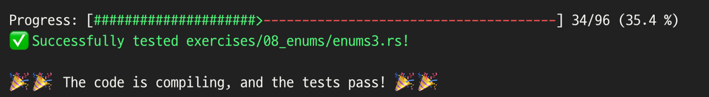
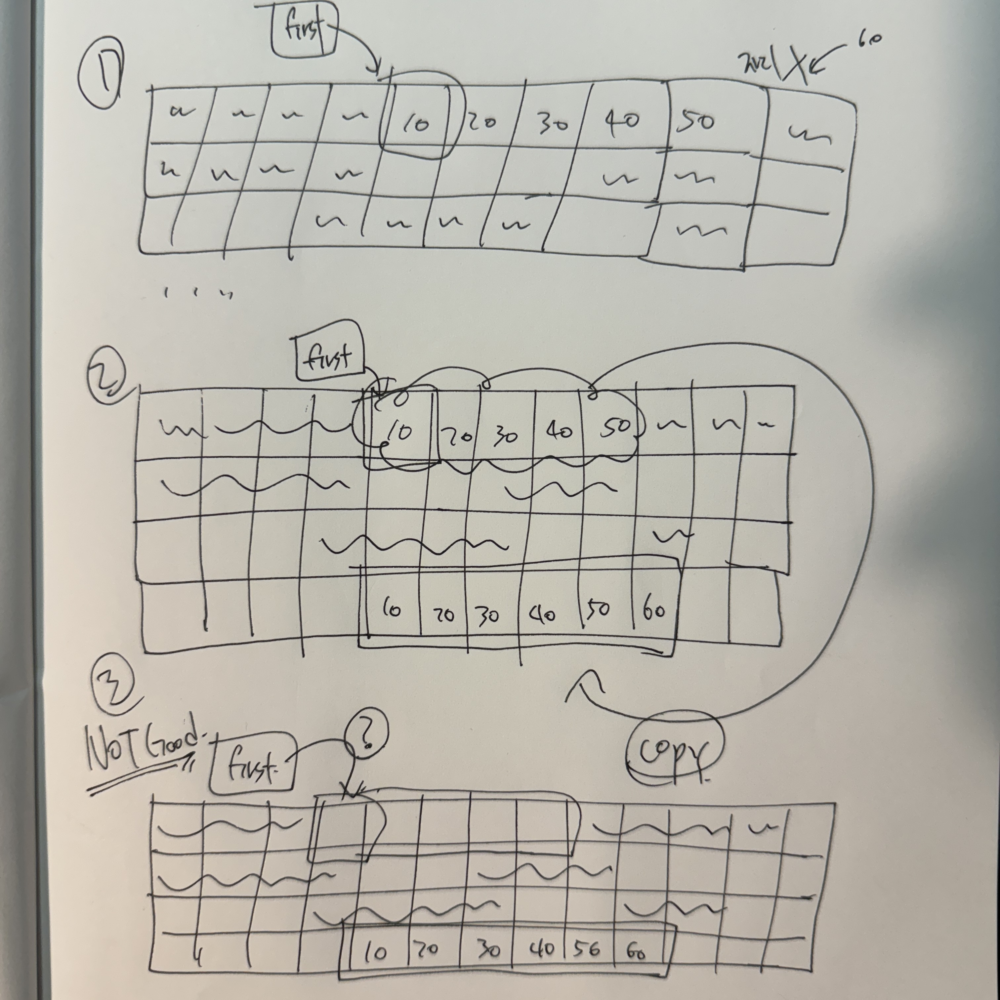

## Week 2 Result


## What I learned


### Vector
* Vector 만들기
```rust
let v: Vec<i32> = Vec::new();

let c = vec![10, 20, 30, 40];
```

* Vector에 값 넣기
```rust
# 러스트는 데이터를 추론하므로 타입 명시(Vec<i32>)를 안 해줘도 된다.

let mut v = Vec::new();

v.push(10);
v.push(20);
v.push(30);
v.push(40);
```

* Vector의 값 드롭
```rust
{
    let mut v = Vec::new();

    vec.push(88);
}
# vector v 내부의 요소들은 모두 드랍(해제/제거)된다.
```

* Vector의 값 읽기
  * [1]과 [2]의 차이점은 에러를 뱉어내는 방식에서 차이가 존재한다.
    * [1]에서 인덱스를 벗어난 요소에 접근을 하고자 하면 `!panic`을 뱉어낸다.
    * [2]의 경우에는 `None`을 반환한다.
  * 따라서 구성하고자 하는 프로그램의 성격에 따라 선택하면 될 것 같다.
```rust
let v = vec![10,20,30,40,50];

# [1] vector v에 대한 인덱스 3의 요소(40)를 가져온다.
let content: &i32 = &v[3];

# [2] vector v에 대한 인덱스를 get() 함수로 넘겨서 Option<&i32>의 값(40)을 받아온다.
let content: Option<&i32> = v.get(3);
```

* Vector의 유효하지 않은 참조자
  * `참조자의 규칙`을 기억해보자
    * **하나의 가변 참조자**만 가지거나
    * **여러 개의 불변 참조자들**만 가질 수 있다.
  * 새로운 요소를 벡터의 끝에 추가하는 동작
    1. first 불변 참조자는 벡터의 첫 번째 요소를 가르키고 있는 상황 + 새로운 요소를 벡터의 끝에 추가할 공간이 없는 상황
    2. 새로운 요소를 벡터의 끝에 추가할 공간이 있는 **힙 메모리**를 할당해서 vector 복사
    3. 기존 first 불변 참조자는 할당이 해제된 메모리를 가르키고 있는 상황
  * 위 상황을 `참조자의 규칙`이 방지하는 역할을 담당한다.

  

```rust
let mut v = vec![10,20,30,40,50];

let first = &v[0];

v.push(6);
```
```rust
error[E0502]: cannot borrow `v` as mutable because it is also borrowed as
immutable
  |
4 | let first = &v[0];
  |              - immutable borrow occurs here
5 |
6 | v.push(6);
  | ^ mutable borrow occurs here
7 | }
  | - immutable borrow ends here
```

* 열거형을 사용해서 Vector에 여러 타입 지정하기
  * 벡터는 같은 타입에 대한 요소들만 가질 수 있다.
  * 컴파일 타임에 벡터에 저장할 타입의 정보가 필요한 이유가 얼만큼의 힙 메모리가 필요한지 알기 위함이다.
  * 다만 벡터에 열거형 요소를 정의한다면 궁극적으로 다른 타입을 담을 열거형 값에 대한 벡터 생성이 가능하다.
```rust
enum vtypes {
  Int(i32),
  Float(f64),
  Text(String),
}

let v = vec![
  vtypes::Int(3),
  vtypes::Text(String::from("hi")),
  vtypes::Float(58.999),
];
```


### Struct
* 구조체 정의
```rust
# 구조체 - 무엇이 들어가는지 대략적으로 정의된 양식 (이름 첫글자 = 대문자)
struct Info {
    username: String,
    address: String,
    number: u64,
    active: bool,
}
```
```rust
# 인스턴스 - 정의된 구조체에 특정한 값을 넣어 실체화한 것
let terry = Info {
    username: String::from("Terry Jo"),
    address: String::from("Seoul"),
    number: 01023415959,
    active: true,
};
```

* 구조체 값 읽어오기
```rust
# 점(.) 표기법을 사용
let mut danny = Info {
  username: String::from("Danny Kim"),
  address: String::from("Tokyo"),
  number: 01023346359,
  active: false,
};

danny.address = String::from("New York");
```

* 구조체 재사용
```rust
# danny의 구조체 인스턴스 address 필드 재사용
let tony = Info {
    username: String::from("Tony Kim"),
    address: danny.address,
    number: 01023335459,
    active: true,
};

# terry의 구조체 인스턴스 재사용
let anna = Info {
    username: String::from("Anna Ho"),
    address: String::from("Seoul"),
    ..terry
};
```

* 튜플 구조체
```rust
struct SimpleInfo(String, String, u64, bool);

let bob = SimpleInfo("Bob Na", "Paris", 01023415459, true);
```