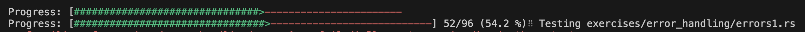

## strings

- https://doc.rust-lang.org/book/ch08-02-strings.html

- `&str` : rust의 문자열 타입. 불변. UTF-8으로 인코딩되어 다른 어딘가에 저장된 문자열 데이터의 참조자
- `String` : 가변, 소유권 가짐

&str과 String 타입 구분하기

```rust
fn string_slice(arg: &str) {
    println!("{}", arg);
}
fn string(arg: String) {
    println!("{}", arg);
}

fn main() {
    string_slice("blue"); // &str
    string("red".to_string()); // String
    string(String::from("hi")); // String
    string("rust is fun!".to_owned()); // String
    string("nice weather".into()); // String
    string(format!("Interpolation {}", "Station")); // String
    string_slice(&String::from("abc")[0..1]); &str
    string_slice("  hello there ".trim()); &str
    string("Happy Monday!".to_string().replace("Mon", "Tues")); // String
    string("mY sHiFt KeY iS sTiCkY".to_lowercase()); // String
}
```

## modules

- https://doc.rust-lang.org/book/ch07-00-managing-growing-projects-with-packages-crates-and-modules.html
- module 내의 코드는 기본적으로 private이고, public 하게 사용하려면 `pub` 키워드를 앞에 붙여야함. export 해서 사용하는 느낌
- module 안에 있는 함수 앞에 `pub` 키워드를 붙여서 사용
- 모듈 안에 모듈을 정의할 수 있음
- `::` 을 이용하여 경로를 나타냄
- use 키워드를 사용하면 단축경로를 만들 수 있음

```rust
mod front_of_house {
    pub mod hosting {
        pub fn add_to_waitlist() {}
    }
}

use crate::front_of_house::hosting; // 절대 경로는 create부터 시작

pub fn eat_at_restaurant() {
    hosting::add_to_waitlist();
}
```

- 외부 패키지를 사용하려면 std 표준 라이브러리에서 사용할 패키지명을 :: 뒤에 붙인다

```rust
use std::time::SystemTime; // 단일 패키지 가져오기
use std::time::{SystemTime, UNIX_EPOCH}; // 여러 패키지 가져오기
use std::time::*; // 모든 패키지 가져오기
```

## hashmaps
- https://doc.rust-lang.org/book/ch08-03-hash-maps.html
- 해시맵 선언
```rust
    use std::collections::HashMap;

    let mut scores = HashMap::new();

    scores.insert(String::from("Blue"), 10);
    scores.insert(String::from("Yellow"), 50);

```

- `entry` 함수는 키가 없을 때만 키와 값을 추가할 수 있다.
- 검사하려는 키를 매개변수로 받고, 해당 키가 있는지 없는지를 나타내는 열거형 Entry를 반환함. 
- `or_intsert` 메서드는 해당 키가 존재할 경우 Entry 키에 대한 연관된 값을 반환하고, 그렇지 않은 경우 매개변수로 제공된 값을 해당 키에 대한 새 값으로 삽입하고 수정된 Entry에 대한 값을 반환함
```rust
    use std::collections::HashMap;

    let text = "hello world wonderful world";

    let mut map = HashMap::new();

    for word in text.split_whitespace() {
        let count = map.entry(word).or_insert(0); // or_insert에 default 값으로 초기화 시켜줌
        *count += 1;
    }

    println!("{:?}", map);

```

## options

- https://doc.rust-lang.org/stable/book/ch10-01-syntax.html#in-enum-definitions

```rust
enum Option<T> {
    Some(T),
    None,
}
```