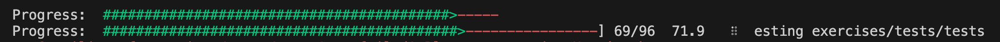

## 9. 에러 처리

- 러스트는 에러를 `복구 가능한 (recoverable) 에러`와 `복구 불가능한 (unrecoverable) 에러` 두 가지 범주로 분류

### 9.1 panic!으로 복구 불가능한 에러 처리하기

**패닉이 일어나는 경우**

1. `panic!` 매크로를 명시적으로 호출

- 패닉이 발생했을 때 실패 메세지 출력, 되감기(unwinding), 스택 청소, 종료

2. 코드의 버그 때문에 라이브러리로부터 `panic!` 호출이 발생

ex. panic!을 일으키는 벡터의 끝을 넘어서는 요소에 대한 접근 시도

```rust
fn main() {
    let v = vec![1, 2, 3];

    v[99];
}
```

```
$ cargo run
   Compiling panic v0.1.0 (file:///projects/panic)
    Finished dev [unoptimized + debuginfo] target(s) in 0.27s
     Running `target/debug/panic`
thread 'main' panicked at 'index out of bounds: the len is 3 but the index is 99', src/main.rs:4:5
note: run with `RUST_BACKTRACE=1` environment variable to display a backtrace
```

- `백트레이스 (backtrace)` : 어떤 지점에 도달하기까지 호출한 모든 함수의 목록
- 백트레이스를 얻기 위해서는 디버그 심볼이 활성화되어 있어야 하는데, `cargo build`나 `cargo run`을 `--release` 플래그 없이 실행했을 때 기본적으로 활성화됨

### 9.2 Result로 복구 가능한 에러 처리하기

**Result 타입**

```rust
enum Result<T, E> {
    Ok(T),
    Err(E),
}

```

- `T`는 성공한 경우에 `Ok` 배리언트 안에 반환될 값의 타입을 나타내고
- `E`는 실패한 경우에 `Err` 배리언트 안에 반환될 에러의 타입을 나타냄
- Result 열거형과 배리언트들은 프렐루드로부터 가져와지므로 Ok와 Err 앞에 Result:: 라고 지정하지 않아도 됨
- ErrorKind::NotFound : 열고자 하는 파일이 아직 존재하지 않음을 나타냄

**에러 발생 시 패닉을 위한 숏컷: unwrap과 expect**

- `unwrap` : Result 값이 Ok이면 Ok 내의 값을 반환하고, Err 배리언트라면, panic! 매크로 호출
- `expect` : unwrap과 비슷하지만 panic! 에러 메시지를 선택할 수 있음
- 보통 unwrap보다 expect를 사용하여 에러 메세지를 명시적으로 제공

```rust
use std::fs::File;

fn main() {
    // unwrap
    let greeting_file = File::open("hello.txt").unwrap();

    // expect
    let greeting_file = File::open("hello.txt")
        .expect("hello.txt should be included in this project");
}
```

**에러 전파하기 (propagating)**

- 에러 전파하기 (propagating) : 에러가 발생한 함수에서 에러를 처리하는 대신 이 함수를 호출하는 코드 쪽으로 에러를 반환하여 그쪽에서 수행할 작업을 결정하도록 하는 것

### 10. 제네릭 타입, 트레이트, 라이프타임

## 10.1 제네릭 타입

- 제네릭을 사용하면 함수 시그니처나 구조체의 아이템에 다양한 구체적 데이터 타입을 사용할 수 있도록 정의할 수 있음
- 제네릭 타입을 사용해도 구체적인 타입을 사용했을 때와 비교해서 런타임에 전혀 느려지지 않음
- 러스트는 컴파일 타임에 제네릭을 사용하는 코드를 단형성화 (monomorphization) 함. (단형성화란 제네릭 코드를 실제 구체 타입으로 채워진 특정한 코드로 바꾸는 과정)

## 10.2 트레이트

- `트레이트 (trait)` : 인터페이스와 유사. 특정한 타입이 가지고 있으면서 다른 타입과 공유할 수 있는 기능을 정의한다.
- 어떤 타입에 대한 트레이트를 구현하는 것은 평범한 메서드를 구현하는 것과 비슷하다. impl 뒤에 구현하고자 하는 트레이트 이름을 적고, 그다음 for 키워드와 트레이트를 구현할 타입명을 명시한다는 점이 다르다. impl 블록 안에는 트레이트 정의에서 정의된 메서드 시그니처를 집어넣되, 세미콜론 대신 중괄호를 사용하여 메서드 본문에 원하는 특정한 동작을 채워 넣습니다.

```rust
pub struct Tweet {
    pub username: String,
    pub content: String,
    pub reply: bool,
    pub retweet: bool,
}

impl Summary for Tweet {
    fn summarize(&self) -> String {
        format!("{}: {}", self.username, self.content)
    }
}
```

- 크레이트 사용자가 타입 뿐만 아니라 트레이트도 스코프로 가져와야 한다.

```rust
use aggregator::{Summary, Tweet};

fn main() {
    let tweet = Tweet {
        username: String::from("horse_ebooks"),
        content: String::from(
            "of course, as you probably already know, people",
        ),
        reply: false,
        retweet: false,
    };

    println!("1 new tweet: {}", tweet.summarize());
}
```

- 매개변수로 트레이트 사용 가능

```rust
pub fn notify(item: &impl Summary) {
    println!("Breaking news! {}", item.summarize());
}
```

- 트레이트 바운드 문법 : 트레이트 바운드는 꺾쇠괄호 안의 제네릭 타입 매개변수 선언에 붙은 콜론 뒤에 위치

```rust
pub fn notify<T: Summary>(item: &T) {
    println!("Breaking news! {}", item.summarize());
}
```

```rust
pub fn notify(item1: &impl Summary, item2: &impl Summary) {
// ->
pub fn notify<T: Summary>(item1: &T, item2: &T) {
```

- `+` 를 사용하여 트레이트 여러 개 지정 가능

```rust
pub fn notify(item: &(impl Summary + Display)) {

pub fn notify<T: Summary + Display>(item: &T) {
```

- where 조항으로 트레이트 바운드 정리

```rust
fn some_function<T: Display + Clone, U: Clone + Debug>(t: &T, u: &U) -> i32 {
// ->
fn some_function<T, U>(t: &T, u: &U) -> i32
where
    T: Display + Clone,
    U: Clone + Debug,
{
```

## 10.3 라이프타임

- 라이프타임은 어떤 타입이 원하는 동작이 구현되어 있음을 보장하기 것이 아니라, 어떤 참조자가 필요한 기간 동안 유효함을 보장하도록 함
- 러스트에서 런타임에 사용되는 실제 참조자가 반드시 유효할 것임을 보장하려면 제네릭 라이프타임 매개변수로 이 관계를 명시해야 함
- 라이프타임의 주목적은 댕글링 참조 (dangling reference) 방지 (댕글링 참조는 프로그램이 참조하려고 한 데이터가 아닌 엉뚱한 데이터를 참조하게 되는 원인)
- 러스트 컴파일러는 대여 검사기 (borrow checker) 로 스코프를 비교하여 대여의 유효성을 판단

ex. r, x의 라이프타임을 각각 'a, 'b로 표현한 주석

```rust
fn main() {
    let r;                // ---------+-- 'a
                          //          |
    {                     //          |
        let x = 5;        // -+-- 'b  |
        r = &x;           //  |       |
    }                     // -+       |
                          //          |
    println!("r: {}", r); //          |
}                         // ---------+
```

ex. 댕글링 참조를 만들지 않고 정상적으로 컴파일되도록 수정한 코드

```rust
fn main() {
    let x = 5;            // ----------+-- 'b
                          //           |
    let r = &x;           // --+-- 'a  |
                          //   |       |
    println!("r: {}", r); //   |       |
                          // --+       |
}                         // ----------+
```

- 라이프타임 명시 문법

```rust
&i32        // 참조자
&'a i32     // 명시적인 라이프타임이 있는 참조자
&'a mut i32 // 명시적인 라이프타임이 있는 가변 참조자
```

- 함수에 사용할 땐 제네릭 타입처럼 꺽쇠괄호 안에 제네릭 라이프타임 매개변수 선언

ex. 함수 시그니처 내 모든 참조자가 동일한 라이프타임 'a를 가져야 함을 나타낸 longest 함수 정의

```rust
// 컴파일되지 않음
fn longest(x: &str, y: &str) -> &str {
    if x.len() > y.len() {
        x
    } else {
        y
    }
}

fn longest<'a>(x: &'a str, y: &'a str) -> &'a str {
    if x.len() > y.len() {
        x
    } else {
        y
    }
}
```

- 모든 참조자는 라이프타임을 가지며, 참조자를 사용하는 함수나 구조체는 라이프타임 매개변수를 명시해야 함
- 라이프타임을 명시하지 않아도 컴파일할 수 있는 이유는 라이프 생략 규칙 때문

- `'static` 정적 라이프타임 (static lifetim) : 해당 참조자가 프로그램의 전체 생애주기 동안 살아있음을 의미. 모든 문자열 리터럴은 static 라이프타임을 가짐

```rust
let s: &'static str = "I have a static lifetime.";
```

- 제네릭 타입 매개변수, 트레이트 바운드, 라이프타임 총 집합!

```rust
use std::fmt::Display;

fn longest_with_an_announcement<'a, T>(
    x: &'a str,
    y: &'a str,
    ann: T,
) -> &'a str
where
    T: Display,
{
    println!("Announcement! {}", ann);
    if x.len() > y.len() {
        x
    } else {
        y
    }
}
```
