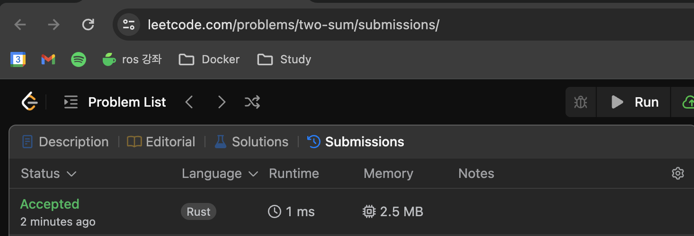
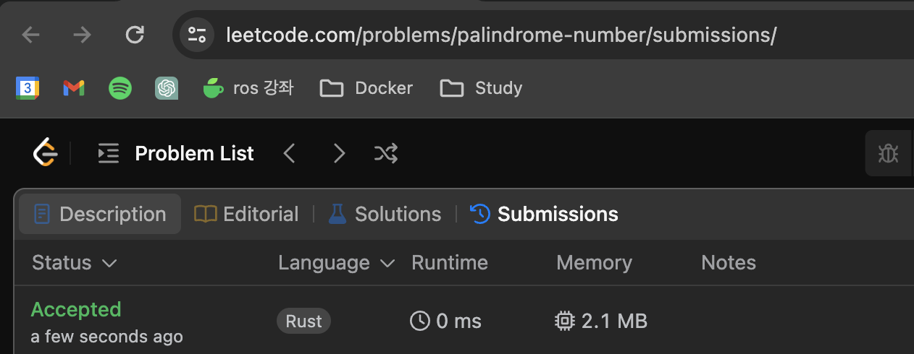

# Week 6 Submission

Two Sum


Valid Parentheses


Palindrome Number


## TIL

### ref와 & 연산자의 차이

아래와 같은 코드가 있다고 하자.

```rust
if let Some(&index) = appearance.get(&looking_for) {

}
```

여기에서 &index가 의미하는 것은 index라는 변수를 reference type으로 만들기 위해서 사용된 것이다. 즉 HashMap의 get() 함수로 Option이 반환되었고, 그 안에 값이 있다면 해당 값을 reference 타입으로 받아오겠다는 것이다.

이 과정에서 변수의 주소를 가리키는 포인터 변수를 만들게 된다.

&가 LHS에서 사용될 때는 type을, RHS에서 사용될 때는 borrow를 하는 연산자가 되며, ref는 LHS에서만 사용할 수 있는 패턴 매칭 키워드이다.

[reference와 패턴매칭](https://velog.io/@undefcat/Rust-reference%EC%99%80-%ED%8C%A8%ED%84%B4%EB%A7%A4%EC%B9%AD)이라는 블로그 글을 참조하여봤지만 여전히 어려운 내용같다. 책의 챕터 18쯤 가면 패턴 매칭 내용이 나오는데, 여기까지 공부를 해야 받아들일 수 있을듯.