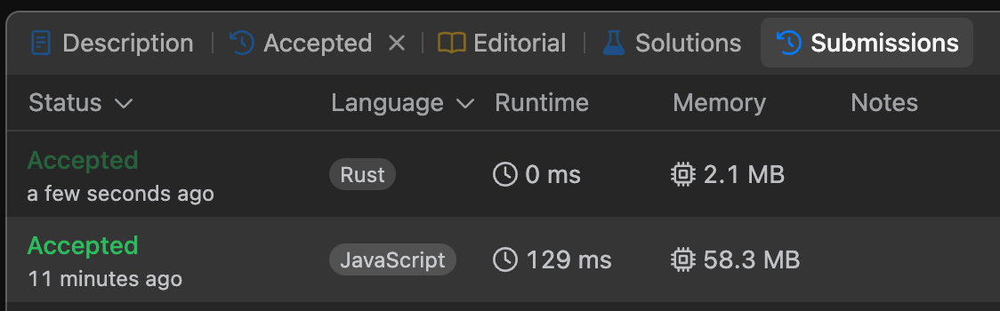
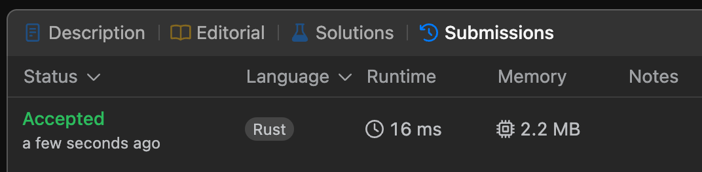
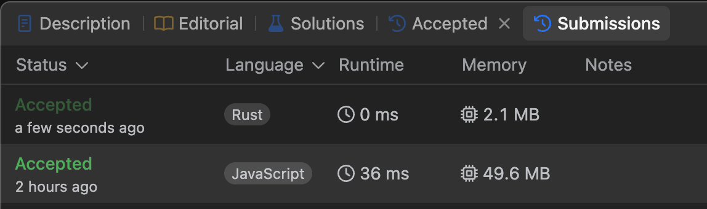

# Leetcode

### [Palindrome Number](https://leetcode.com/problems/palindrome-number/description/)



- rust

```rust
impl Solution {
    pub fn is_palindrome(x: i32) -> bool {
        return x.to_string().chars().rev().eq(x.to_string().chars())
    }
}
```

- javascript

```jsx
/**
 * @param {number} x
 * @return {boolean}
 */
var isPalindrome = function (x) {
  return x.toString() === x.toString().split("").reverse().join("");
};
```

### [Two Sum](https://leetcode.com/problems/two-sum/description/)



- rust

```rust
impl Solution {
    pub fn two_sum(nums: Vec<i32>, target: i32) -> Vec<i32> {
        for i in 0..nums.len() - 1 {
            for j in i + 1..nums.len() {
                if nums[i] + nums[j] == target {
                    return vec![i as i32, j as i32];
                }
            }
        }

        vec![]
    }
}
```

### [Valid Parentheses](https://leetcode.com/problems/valid-parentheses)



- rust

```rust
impl Solution {
    pub fn is_valid(s: String) -> bool {
        let mut brackets = Vec::new();

        for bracket in s.chars() {
            match bracket {
                '{' => brackets.push('}'),
                '(' => brackets.push(')'),
                '[' => brackets.push(']'),

                closing => if Some(closing) != brackets.pop() {
                    return false
                }
            }
        }
        brackets.is_empty()
    }
}
```

- javascript

```jsx
/**
 * @param {string} s
 * @return {boolean}
 */
var isValid = function (s) {
  let stack = [];

  for (let i = 0; i < s.length; i++) {
    if (s[i] === "(" || s[i] === "{" || s[i] === "[") {
      stack.push(s[i]);
    } else {
      let top = stack[stack.length - 1];
      if (
        (s[i] === ")" && top === "(") ||
        (s[i] === "}" && top === "{") ||
        (s[i] === "]" && top === "[")
      ) {
        stack.pop();
      } else {
        return false;
      }
    }
  }

  if (stack.length > 0) {
    return false;
  }

  return true;
};
```
