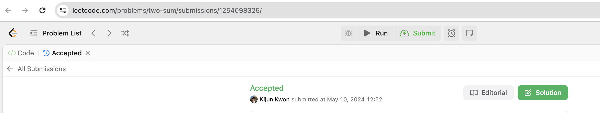
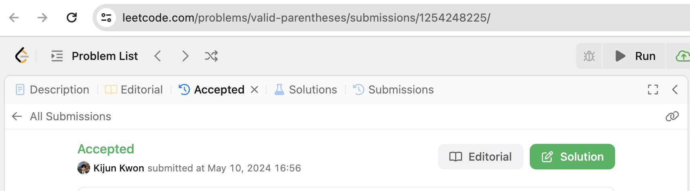
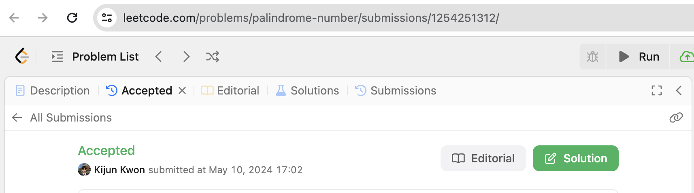

# Week 6 Submission





# TIL
## 1. Two Sum
```rust
impl Solution {
    pub fn two_sum(nums: Vec<i32>, target: i32) -> Vec<i32> {
        for i in 0..nums.len() {
            let diff = target - nums[i];

            for j in (i + 1)..nums.len() {
                if nums[j] == diff {
                    return vec![i as i32, j as i32];
                }
            }
        }
        Vec::new()
    }
}
```
- j를 찾는 로직을 추후 배울 개념인 **반복자**를 통해 구현하면 더 깔끔한 코드 작성이 가능한 듯 하다.
  - `if let Some(j) = nums[i+1..].iter().position(|&x| x == diff)`
  - python의 lambda, java의 stream 등 함수형 프로그래밍 형태를 rust에서도 사용할 수 있다.
- 이 문제는 HashMap을 이용하면 시간복잡도를 `O(n)`으로 줄일 수 있다고 한다.
  - 도전해보세요!

## 2. Valid Parentheses
```rust
impl Solution {
    pub fn is_valid(s: String) -> bool {
        let mut stack = Vec::new();

        for c in s.chars() {
            match c {
                '(' | '{' | '[' => stack.push(c),
                ')' => if stack.pop() != Some('(') { return false },
                '}' => if stack.pop() != Some('{') { return false },
                ']' => if stack.pop() != Some('[') { return false },
                _ => panic!()
            }
        }
        stack.is_empty()
    }
}
```
- 익숙한 문제였기에, rust의 특성을 활용하는 방향으로 코드를 작성해보았다.
- match 사용 시, 가능한 모든 경우의 수에 대해 처리해줘야 함을 기억하자.
  - 이 경우, `_` 자리표시자를 통해 나머지 모든 경우에 대해 panic!을 호출하도록 했다.
- stack.pop()의 반환값이 Optional임을 기억하자.
  - 어떤 메서드가 Optional을 반환하는지는 경험이 쌓여야 직관적으로 알 수 있을 것 같다. 

## 3. Palindrome Number
```rust
impl Solution {
    pub fn is_palindrome(mut x: i32) -> bool {
        if x < 0 {
            return false;
        }

        if x == 0 {
            return true;
        }

        let mut digits = Vec::new();

        while x > 0 {
            digits.push(x % 10);
            x /= 10;
        }

        let mut i = 0;
        let mut j = digits.len() - 1;

        while i < j {
            if digits[i] != digits[j] {
                return false;
            }

            i += 1;
            j -= 1;
        }

        true
    }
}
```
- 익숙한 문제였으며, Rust의 장점을 활용하기보단 효율성에 집중했다.
- 숫자를 문자열로 변환 후 비교하는 방법 또한 가능한데, 이 경우 rust의 특성을 더 잘 활용할 수 있다.
  - `x.to_string() == x.to_string().chars().rev().collect::<String>()`
  - 시간 복잡도는 작살난다.